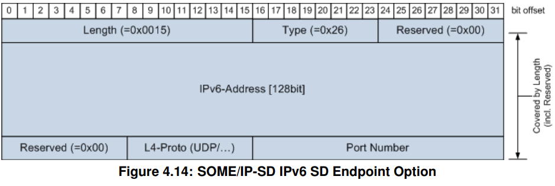
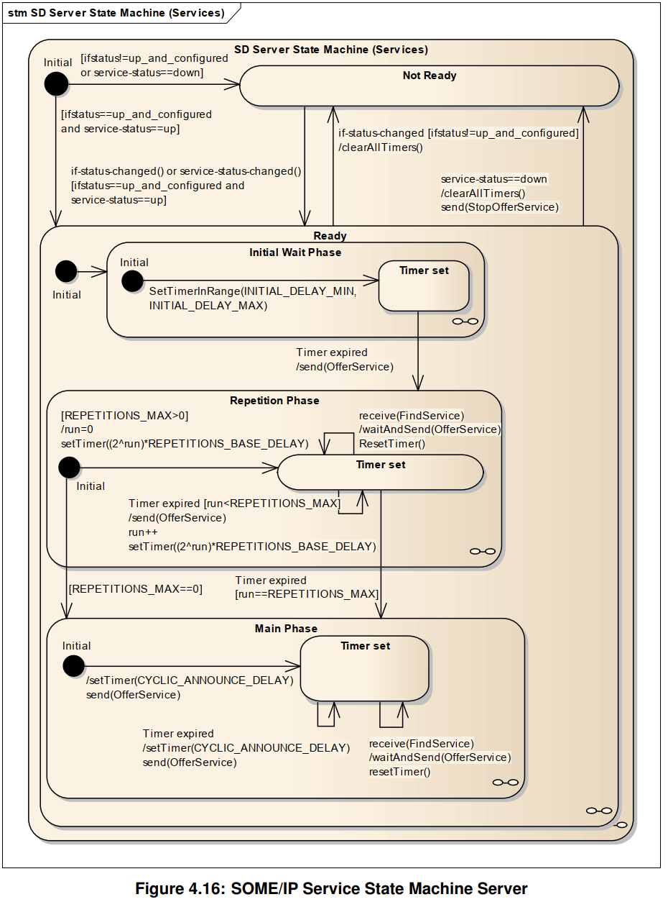

# SOMEIP/SD

## 1. SOMEIP/SD Header layout

## 2. SOMEIP/SD Header SPECIFICATION

### 2.1 FLAG
1. Flags[8bit] = (Highest order bit)reboot_flag[1bit] + unicast_flag[1bit] + unused[8]
2. Reboot Flag
   1. shall be set to 1, until reboot end.
   2. if old.reboot == 0 and new.reboot == 1 --> reboot detected
   3. if old.reboot == 1 and new.reboot == 1 and old.session_id >= new session.id --> reboot other session --> reboot detected
3. Unicast Flag
   1. for unicast message, this bit shall be set to 1.

### 2.2 Entry
1. One service discovery message = N * entry information.
2. Two types of entries exits: A service entry type for services and an event-group entry type for event-groups.
   1. 
   2. 
3. Index first option run: Index 0 = first of SOMEIP/SD packet. 
4. Index second option run: Index 0 = first of SOMEIP/SD packet.
5. Length 0 = no option in option run.
6. Options format
   1. Options are used to transport additional information to the entries. This includes for instance the information how a service instance is reachable.
   2. Options may include: IP_Address, Transport protocol, Port-Number.
   3. Options format:
      1. length: specifies the length of the option in bytes.
      2. type: specifying the type of option.
      3. discardable flag: specifies if the option can be discarded.
      4. bit 1 to bit 7 are reserved and shall be 0.
      5. Configuration String: shall carry the configuration string.

### 2.3 Different kinds of Options
1. Load Balancing Option
   1. 
   2. Load Balancing = ... + **Priority** + **Weight**
   3. the client should choose the service instance with the highest priority.
   4. When having more than one service instance with the highest priority, the service instance shall be chosen randomly based on the weights.
2. IPV4 Endpoint Option
   1. 
   2. IPV4 = ... + **IPV4-Address** + **Protocol** + **Port**
3. IPV6 Endpoint Option
   1. 
   2. IPV6 = ... + **IPV6-Address** + **Protocol** + **Port**
4. IPV4 Multicast Option
   1. 
   2. IPV4 address shall be multicast address.
   3. IPV4 multicast options shall be referenced by Subscribe-Event-group or by Stop-Subscribe-Event_group or by Subscribe-Event-group-ACK.
   4. port number:
      1. server: port provided by corresponding event-group from client.
      2. client: port provided by corresponding event-group from server.
5. IPV6 Multicast Option
   1. 
   2. IPV6 address shall be multicast address.
   3. IPV6 multicast options shall be referenced by Subscribe-Event-group or by Stop-Subscribe-Event_group or by Subscribe-Event-group-ACK.
   4. port number:
      1. server: port provided by corresponding event-group from client.
      2. client: port provided by corresponding event-group from server.
6. IPV4 SD Endpoint Option
   1. 
7. IPV6 SD Endpoint Option
   1. 

### 2.4 Service Entries
1. Find Service Entry
   1. the find service entry shall be used for finding service instances and shall only be sent if the current state of a service is unknown.
   2. entry field:
      1. type = 0x00 find service
      2. instance id = 0xFFFF
      3. major version = 0xFF
      4. minor Version = 0xFFFFFFFF
      5. TTL = 0x00000000 = stop, TTL = 0xFFFFFFFF = considered valid until next reboot.
      6.  发送方不应在Find Service Entry中引用Endpoint Options或Multicast Options。
          接收方应在Find Service Entry中忽略Endpoint Options和Multicast Options。
2. Offer Service Entry
   1. The offer service entry type shall be used to offer a service to other communication partners.
   2. entry field:
      1. type = 0x01 offer service
      2. service id, instance id, major version, minor version, shall be set to the service instance that is offered.
   3. offer service entries shall always reference either an IPV4 or IPV6 endpoint option to signal how the service is reachable.
3. Stop Offer Entry
   1. the stop offer entry type shall be used to stop offering service instances.
   2. entry field:
      1. all same as offer entry.
      2. TTL = 0x00000000.

### 2.5 Service Endpoints
1. The referenced endpoint options of the offer service entries denotes the :
   1. IP Address and Port Numbers the service instance is reachable at the server.
   2. IP Address and Port Numbers the service instance sends the events from.
2. Event Group Endpoints

### 2.6 Example

1. SOMEIP/SD Server -> Client: offer service
2. SOMEIP/SD Client -> Server: [OPEN TCP] TCP.SYN()
3. SOMEIP/SD Server -> Client: [OPEN TCP] TCP.SYNC/ACK()
4. SOMEIP/SD Client -> Server: [OPEN TCP] TCP.ACK()
5. SOMEIP/SD Client -> Server: send a subscribe event group 
6. SOMEIP/SD Server -> Client: response ACK of subscribe event group
7. NOW CLIENT SUBSCRIBES.
8. SOMEIP Server -> Client: UDP initial, TCP initial
9. SOMEIP Client -> Server: method call
   1. FOR UDP: server unicast  <===> client unicast
   2. FOR TCP: server TCP <===> client TCP

### 2.7 state machine

