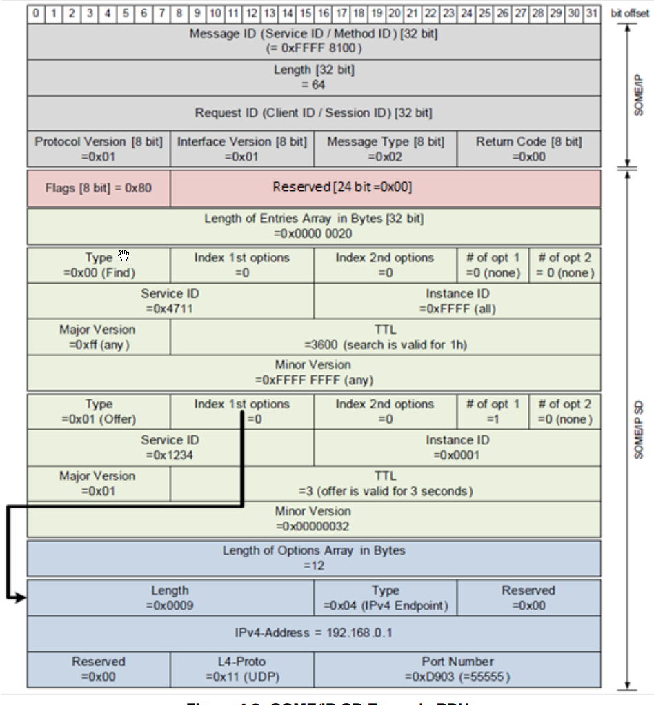
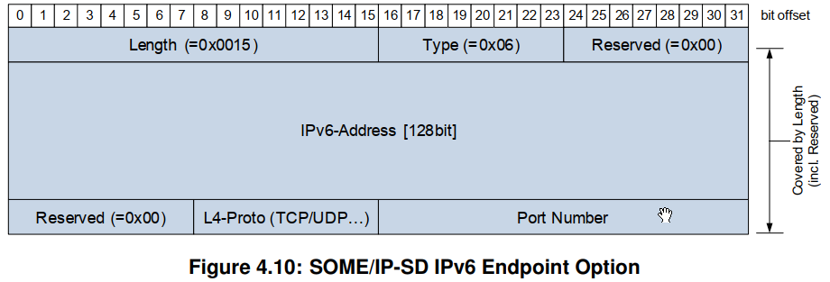

# SOMEIP/SD

## 1. SOMEIP/SD Header layout

## 2. SOMEIP/SD Header SPECIFICATION

### 2.1 FLAG
1. Flags[8bit] = (Highest order bit)reboot_flag[1bit] + unicast_flag[1bit] + unused[8]
2. Reboot Flag
   1. shall be set to 1, until reboot end.
   2. if old.reboot == 0 and new.reboot == 1 --> reboot detected
   3. if old.reboot == 1 and new.reboot == 1 and old.session_id >= new session.id --> reboot other session --> reboot detected
3. Unicast Flag
   1. for unicast message, this bit shall be set to 1.

### 2.2 Entry
1. One service discovery message = N * entry information.
2. Two types of entries exits: A service entry type for services and an event-group entry type for event-groups.
   1. 
   2. 
3. Index first option run: Index 0 = first of SOMEIP/SD packet. 
4. Index second option run: Index 0 = first of SOMEIP/SD packet.
5. Length 0 = no option in option run.
6. Options format
   1. Options are used to transport additional information to the entries. This includes for instance the information how a service instance is reachable.
   2. Options may include: IP_Address, Transport protocol, Port-Number.
   3. Options format:
      1. length: specifies the length of the option in bytes.
      2. type: specifying the type of option.
      3. discardable flag: specifies if the option can be discarded.
      4. bit 1 to bit 7 are reserved and shall be 0.
      5. Configuration String: shall carry the configuration string.

### 2.3 Different kinds of Options
1. Load Balancing Option
   1. 
   2. Load Balancing = ... + **Priority** + **Weight**
   3. the client should choose the service instance with the highest priority.
   4. When having more than one service instance with the highest priority, the service instance shall be chosen randomly based on the weights.
2. IPV4 Endpoint Option
   1. 
   2. IPV4 = ... + **IPV4-Address** + **Protocol** + **Port**
3. IPV6 Endpoint Option
   1. 
   2. IPV6 = ... + **IPV6-Address** + **Protocol** + **Port**
4. IPV4 Multicast Option
   1. 
   2. IPV4 address shall be multicast address.
   3. IPV4 multicast options shall be referenced by Subscribe-Event-group or by Stop-Subscribe-Event_group or by Subscribe-Event-group-ACK.
   4. port number:
      1. server: port provided by corresponding event-group from client.
      2. client: port provided by corresponding event-group from server.
5. IPV6 Multicast Option
   1. 
   2. IPV6 address shall be multicast address.
   3. IPV6 multicast options shall be referenced by Subscribe-Event-group or by Stop-Subscribe-Event_group or by Subscribe-Event-group-ACK.
   4. port number:
      1. server: port provided by corresponding event-group from client.
      2. client: port provided by corresponding event-group from server.
   